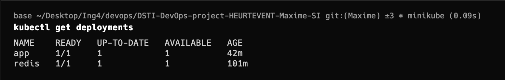
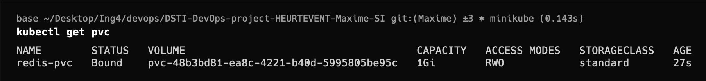
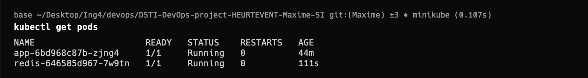
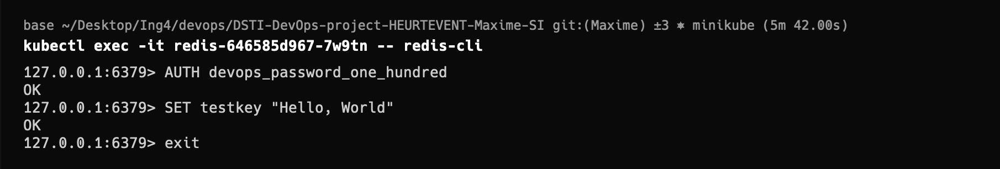
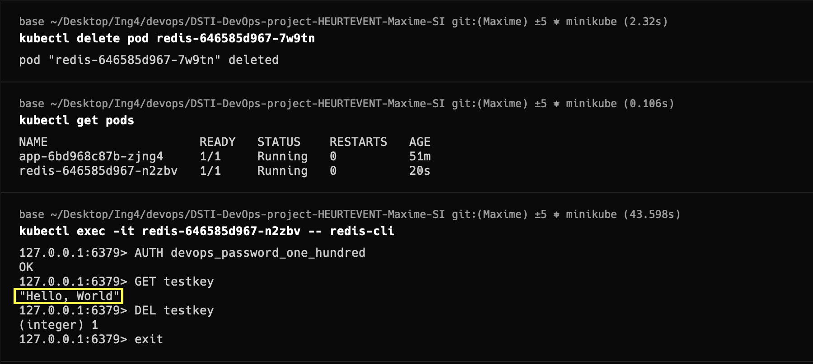

# Persistant Volume Claim

## Pvc verifications

First ensure of the good running of the cluster:

Verify the creation of the pvc:

Get the redis pod name:

Connect to the redis cli and set a key value:

Then delete the pod, kubernetes will recreate it automatically and verify that the key is still present:

