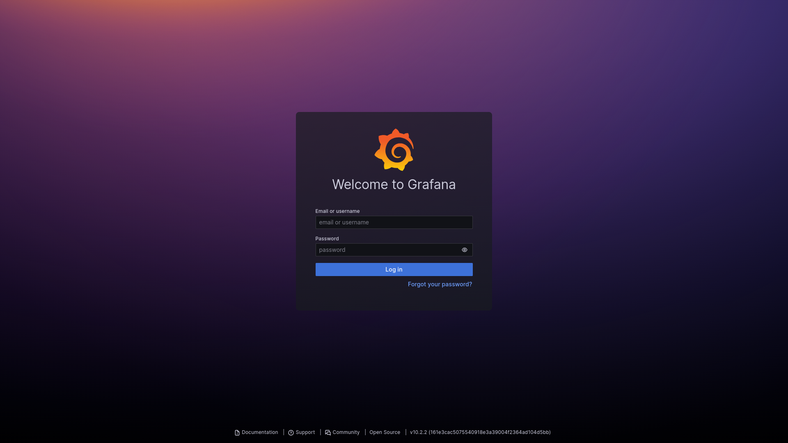
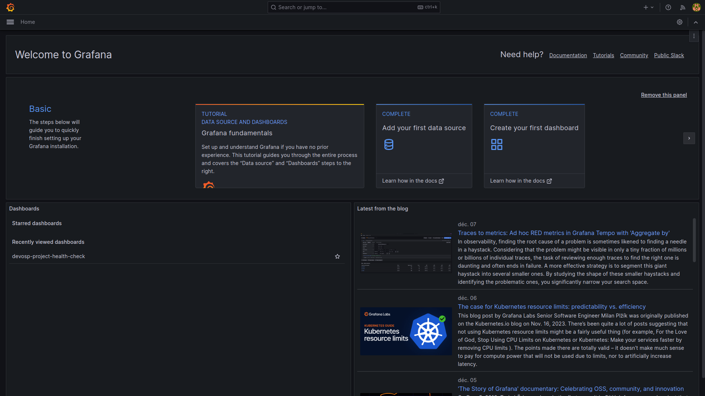
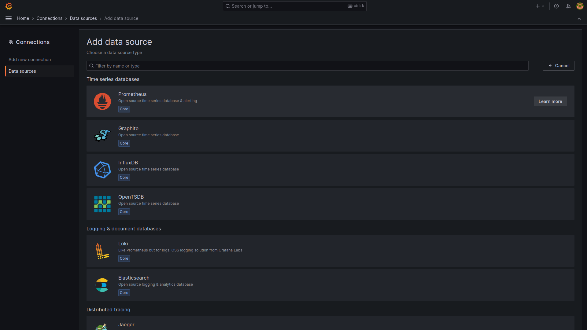
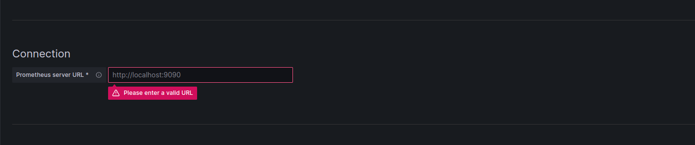
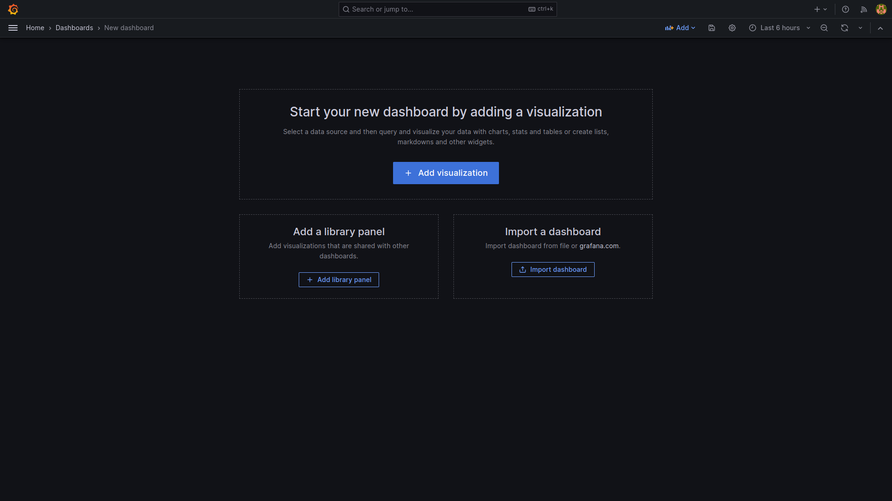
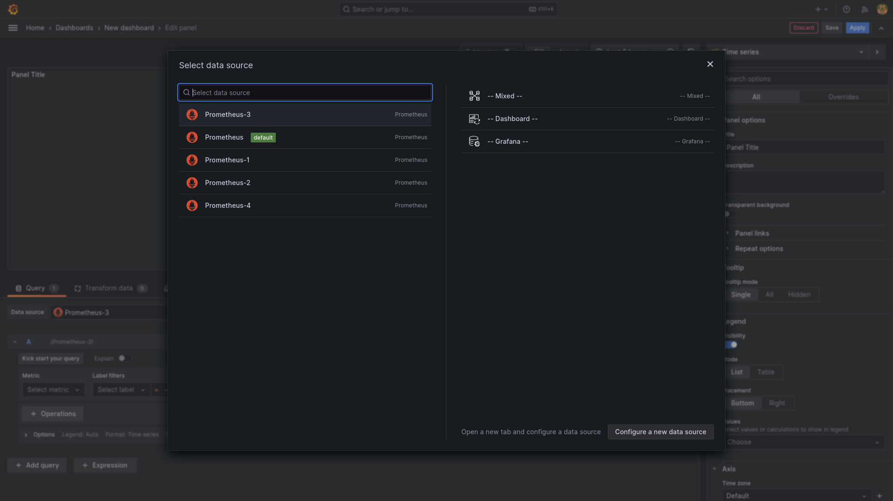
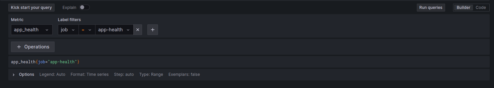
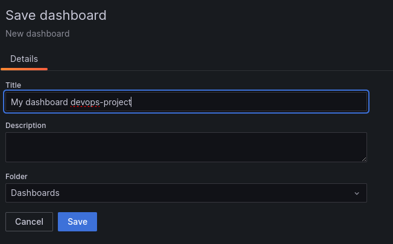

# Grafana Tutorial

## Login to Grafana
First of all connect to the grafana address: `http://<MINIKUBE_IP>:32000/`

Then when you are on the login page, use the following credentials:
- username: `admin`
- password: `Lecoq-Heurtevent-Password`

## Add a data source
To add a data source, click on Add your first data source:

Then select Prometheus:

Then change the URL to `http://prometheus-service.devops-project.svc.cluster.local:9090` and click on Save & Test:

Then go to the home page

## Then Create a dashboard

Click on create your first dashboard:

Then click on add a visualization:

Then select the Prometheus data source you created earlier:

Then select the query you want to display for example app_health and click on run queries:

Then click save dashboard:

Then give a name to your dashboard and click on save and congratulations you have created your first dashboard

