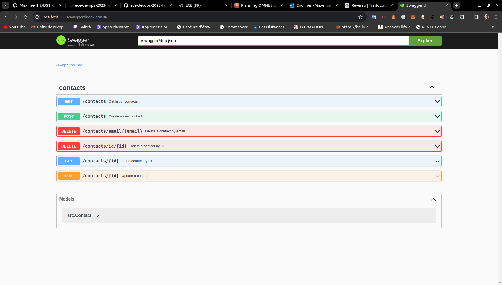

# Vagrant & Ansible

## Vagrant and Ansible verifications

First ensure the good build of the virtual machine:
```shell
# Run the Vagrant configuration
vagrant up
```


As we can see, the virtual machine is running and the Ansible playbook has been executed successfully.

Verify that the virtual machine is running --> [Swagger](http://localhost:3000/swagger/index.html#/)



here we can see that the virtual machine is running and the API is available on port 3000 with the path /swagger/index.html

