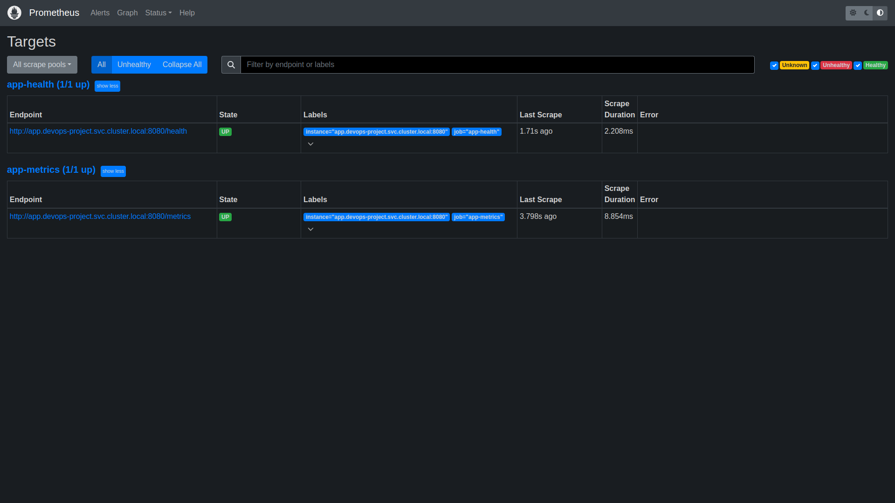
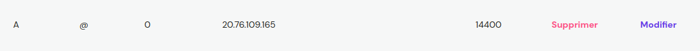

# DSTI-DevOps-project-HEURTEVENT-Maxime-SI

## Summary
- [Installation](#installation)
- [1. Create a web application](#1-create-a-web-application)
- [2. Apply CI/CD pipeline](#2-apply-cicd-pipeline)
- [3. Configure and provision a virtual environment (Vagrant)](#3-configure-and-provision-a-virtual-environment-vagrant)
- [4. Build Docker image and push it to Docker Hub](#4-build-docker-image-and-push-it-to-docker-hub)
- [5. Make container orchestration using Docker Compose](#5-make-container-orchestration-using-docker-compose)
- [6. Make docker orchestration using Kubernetes](#6-make-docker-orchestration-using-kubernetes)
- [7. Make a service mesh using Istio](#7-make-a-service-mesh-using-istio)
- [8. Implement Monitoring to your containerized application](#8-implement-monitoring-to-your-containerized-application)
- [9. Project Documentation](#9-project-documentation)

| Subject                                                            | Code | Max. grade | Status |
|:-------------------------------------------------------------------|:----:|:----------:|--------|
| 🧪 Enriched web application with automated tests                   | APP  |     +1     | ✅      |
| 🔄 Continuous Integration and Continuous Delivery (and Deployment) | CICD |     +3     | ✅      |
| 🐳 Containerisation with Docker                                    |  D   |     +1     | ✅      |
| 🚜 Orchestration with Docker Compose                               |  DC  |     +2     | ✅      |
| ⚓️ Orchestration with Kubernetes                                   | KUB  |     +3     | ✅      |
| 🕸️ Service mesh using Istio                                       | IST  |     +2     |  ✅       |
| 💻 Infrastructure as code using Ansible                            | IAC  |     +3     | ✅      |
| 📊 Monitoring                                                      | MON  |     +2     | ✅        |
| 📝 Accurate project documentation in README.md file                | DOC  |     +3     | ✅      |
| + Each bonus task                                                  | BNS  |     +1     | ✅      |
| - Each penalty                                                     | PNL  |     -1     |        |

| Bonus                                  |
|----------------------------------------|
| Golang CRUD App                        |
| Swagger                                |
| Static Front                           |
| Docker Hub pipeline                    |
| Docker Hub pipeline w/ Jenkins         |
| Docker Hub Overview                    |
| Kubernetes Cluster Deployment on Azure |
| Kiali                                  |
| Domain name                            |


## Installation
Start by cloning the repository:
```shell
git clone git@github.com:Maxime-Hrt/DSTI-DevOps-project-HEURTEVENT-Maxime-LECOQ-Maxence-SI.git
```
Then, move to the project directory:
```shell
cd DSTI-DevOps-project-HEURTEVENT-Maxime-LECOQ-Maxence-SI
```

## 1. Create a web application
### Prerequisites
The web application is a basic CRUD application that uses Redis as a database. It is written in Go and uses the
[Fiber](https://gofiber.io/) framework. To run the application, you will need to install:
- [Go](https://golang.org/doc/install)
- [Redis](https://redis.io/download)

### Run the application
To run the application, you will need to start Redis and then run the application. To do so, you can run the following commands:
```shell
# Start Redis
redis-server
```
```shell
# Move to the user directory
cd user
```
If you are running the application for the first time, you will need to install the dependencies:
```shell
# Install the dependencies
go get .
```
```shell
# Run the application
go build && ./devops-project
```
You can now access the application with the [Swagger UI](http://localhost:8080/swagger/index.html#/), the **static frontview** or simply verify it's good running with the [health check](http://localhost:8080/health).

### <p style="text-align: center;">Swagger UI</p>

<p align="center">
    
</p>

### <p style="text-align: center;">Static Front</p>


<p align="center">
    
</p>

### Run the tests
To run the tests, you will need to start Redis and then run the tests. To do so, you can run the following commands:
```shell
# Start Redis
redis-server
```
```shell
# Move to the user/test directory
cd user/test
```
```shell
# Run the tests
go test -v
```

## 2. Apply CI/CD pipeline
### Prerequisites
To apply the CI/CD pipeline, you will need to install:
- [Docker](https://docs.docker.com/get-docker/)
### Run the pipelines
Three pipelines are available using GitHub Actions. 

The first one described in `go_test.yml` is used to build the application and **run the tests** on each push.
### <p style="text-align: center;"> Go Test Actions</p>
<p align="center">
    
</p>

The second one (related to the 4th part of the project) described in `docker_hub.yml` is used to build the Docker image and **push it to Docker Hub** on each push on the `main` branch or release.

### <p style="text-align: center;"> Docker Hub Actions</p>
<p align="center">
    
</p>

To push the Docker image to Docker Hub, we have also created a pipeline using Jenkins. It is described in `Jenkinsfile`, it is runnable from the Jenkins UI.
<p align="center">
    
    
</p>

### Deploy the application on Azure

The third one is a pipeline to deploy the application on Azure. It is described in `azure.yml` and is triggered on each release.
Our Azure app is deployed as a **kubernetes cluster** with a **load balancer** and a **persistent volume claim** for Redis database (you will find more about it in the [6th part](#6-make-docker-orchestration-using-kubernetes)).

### <p style="text-align: center;"> Azure Actions</p>
<p align="center">
    
</p>

### <p style="text-align: center;"> App hosted on Azure</p>
<p align="center">
    
</p>


## 3. Configure and provision a virtual environment (Vagrant)
### Prerequisites
To configure and provision a virtual environment, you will need to install:
- [VirtualBox](https://www.virtualbox.org/wiki/Downloads)
- [Vagrant](https://developer.hashicorp.com/vagrant/downloads)
- [Ansible](https://docs.ansible.com/ansible/latest/installation_guide/intro_installation.html)

Install vagrant Accoding to the documentation for the **VirtualBox** provider.
### Configure with Vagrant
To build the virtual environment with Vagrant and Ansible, you can run the following command from the root directory:
```shell
# Run the Vagrant configuration
vagrant up
```

<p align="center">
    
</p>

Verify that the virtual machine is running --> [Swagger](http://localhost:3000/swagger/index.html#/)

<p align="center">
    
</p>

## 4. Build Docker image and push it to Docker Hub
### Prerequisites
To build the Docker image, you will need to install:
- [Docker](https://docs.docker.com/get-docker/)

Our Docker image is available on [Docker Hub](https://hub.docker.com/r/maximehrt/devops-project-image/tags)
you can pull it using the following command:
```shell
# Pull the Docker image
docker pull maximehrt/devops-project:latest
```

### Build the Docker image
To build the Docker image, you can run the following command:
```shell
# Build the Docker image
docker build -t devops-project-app -f ./user/Dockerfile .
```
You can now run the Docker image:
```shell
# Run the Docker image
docker run -p 8080:8080 devops-project-app
```
### Push the Docker image to Docker Hub
To push the Docker image to Docker Hub, you will need to login to Docker Hub:
```shell
# Login to Docker Hub
docker login
```
Tag the Docker image:
```shell
# Tag the Docker image
docker tag devops-project-app maximehrt/devops-project-app:latest
```
Then, you can push the Docker image to Docker Hub:
```shell
# Push the Docker image to Docker Hub
docker push maximehrt/devops-project-app:latest
```

<p align="center">
    
</p>

## 5. Make container orchestration using Docker Compose
From the root directory, run the following command:
```shell
# Run the Docker Compose
docker-compose up -d
```
You can now access the application with the [Swagger UI](http://localhost:8080/swagger/index.html#/) or verify it's good running with the [health check](http://localhost:8080/health).

<p align="center">
    
</p>

## 6. Make docker orchestration using Kubernetes

### Prerequisites
To make docker orchestration using Kubernetes, you will need to install:
- [Kubernetes](https://kubernetes.io/docs/tasks/tools/install-kubectl/)
- [Minikube](https://minikube.sigs.k8s.io/docs/start/)
- [Kompose](https://kompose.io/installation/)

Start the cluster:
```shell
# Start the cluster
minikube start
```
### Create Kubernetes manifests files (Kompose)
From the root directory with explicit variables in the `docker-compose.yml`, run the following command:
```shell
# Create Kubernetes manifests files
kompose convert -f docker-compose.yml
```
Move the files into the appropriate directory:

<p>
    
</p>

Don't forget to add the docker image path in the `app-deployment.yaml` file:
```yaml
...
spec:
  containers:
  - image: maximehrt/devops-project-app:latest
...
```
To synchronize the app service with **Azure** add in the `app-service.yaml` file:
```yaml
...
spec:
  type: LoadBalancer
...
```

### Persistent Volume Claim
Create a persistent volume claim for Redis database to store data in a persistent volume which means that the data will be stored even if the pod is deleted.

Add a `redis-pvc.yaml` file in the `k8s/redis` directory:
```yaml
apiVersion: v1
kind: PersistentVolumeClaim
metadata:
  name: redis-pvc
spec:
  accessModes:
    - ReadWriteOnce
  resources:
    requests:
      storage: 1Gi
```

### Run the application
From the root directory, run the following command to create deployments, services and persistent volume claim:
```shell
# Run the application
kubectl apply -f k8s/
```
Wait for the pods to be ready (the time to pull the Docker image):
```shell
# Wait for the pods to be ready
kubectl get pods
```
When the pods are ready, you can access the application with the following command:
```shell
# Access the application
minikube service app
```
By the way, on the Azure portal in the **Run Command** you can also see the good running of the application:

<p align="center">
    
</p>

### Proof of work
Click [here](https://github.com/Maxime-Hrt/DSTI-DevOps-project-HEURTEVENT-Maxime-LECOQ-Maxence-SI/blob/main/Images/kubernetes_imgs/PVC.md) to see the proof of work

## 7. Make a service mesh using Istio

### Prerequisites
To make a service mesh using Istio, you will need to install:
- [Istio](https://istio.io/latest/docs/setup/getting-started/#download)
- [Kubernetes](https://kubernetes.io/docs/tasks/tools/install-kubectl/)
- [Minikube](https://minikube.sigs.k8s.io/docs/start/)

Go to the `/` directory of the project and run the following command:
```shell
# Start the configuration
kubectl apply -f ./istio/
kubectl apply -f ./k8s/app/istio/
kubectl apply -f ./k8s/redis/istio/
```

Then run the following command to see the pods:
```shell
# Get the pods
kubectl get pod -n devops-project
```

if you want to see the redirections of the traffic in the shell you can run the following command:
```shell
for i in {1..20}; do curl $(minikube service app --url -n devops-project)/version; done
```

if you want to see the redirections of the traffic in the Kiali dashboard you can run the following command:
```shell
for i in {1..20}; do curl $(minikube service app --url -n devops-project); done
istioctl dashboard kiali
```

Then you will be able to see the dashboard on the following url: `http://localhost:20001/kiali/console`

<p align="center">
    
</p>

above you can see the redirections of the traffic in the Kiali dashboard

## 8. Implement Monitoring to your containerized application

### Prerequisites
To Implement Monitoring to your containerized application, you will need to install:
- [Kubernetes](https://kubernetes.io/docs/tasks/tools/install-kubectl/)
- [Minikube](https://minikube.sigs.k8s.io/docs/start/)

Go to the `/` directory of the project and run the following command:
```shell
# Start the configuration
kubectl apply -f ./prometheus/
```
Then, run the following command to get the IP address of miniKube:
```shell
# Get the IP address of the Prometheus service
kubectl get nodes -o wide
```

Then take the internal IP address of minikube and add the port 30000 to access to Prometheus dashboard example: `http://minikube_ip:30000/targets?search=`

<p align="center">
    
</p>

To add grafana dashboard, run the following command:
```shell
# Start the configuration
kubectl apply -f ./grafana/
```
Then, run the following command to get the IP address of miniKube:
```shell
# Get the IP address of the Grafana service
kubectl get nodes -o wide
```

Then take the internal IP address of minikube and add the port 32000 to access to Grafana dashboard example: `http://minikube_ip:32000/`

To add prometheus as a data source and see in the dashboard the metrics of the application follow this [tutorial](https://github.com/Maxime-Hrt/DSTI-DevOps-project-HEURTEVENT-Maxime-LECOQ-Maxence-SI/blob/main/Images/monitoring/grafana_tutorial.md)

Here is an example of the dashboard when the application is running and grafana is connected to prometheus with the endpoint `/health`:

<p align="center">
    
</p>

## 9. Project Documentation

## 10. Bonus tasks

First of all we buy a domain name on [hostinger](https://www.hostinger.fr/)

<p align="center">
    
</p>

Then we redirect the domain name to the IP address of the Azure VM:

<p align="center">
    
</p>

Then you can check the application on the domain name: [ece-devops-project-maxence-maxime-aks.cloud](http://ece-devops-project-maxence-maxime-aks.cloud/swagger/index.html#/) if azure is running 

<p align="center">
    
</p>

If Azure is not running you can check the redirection of the domain name to the IP address of the Azure VM on [dnschecker](https://dnschecker.org/#A/devops-project.fr)

<p align="center">
    
</p>

<p align="center">
    
</p>


